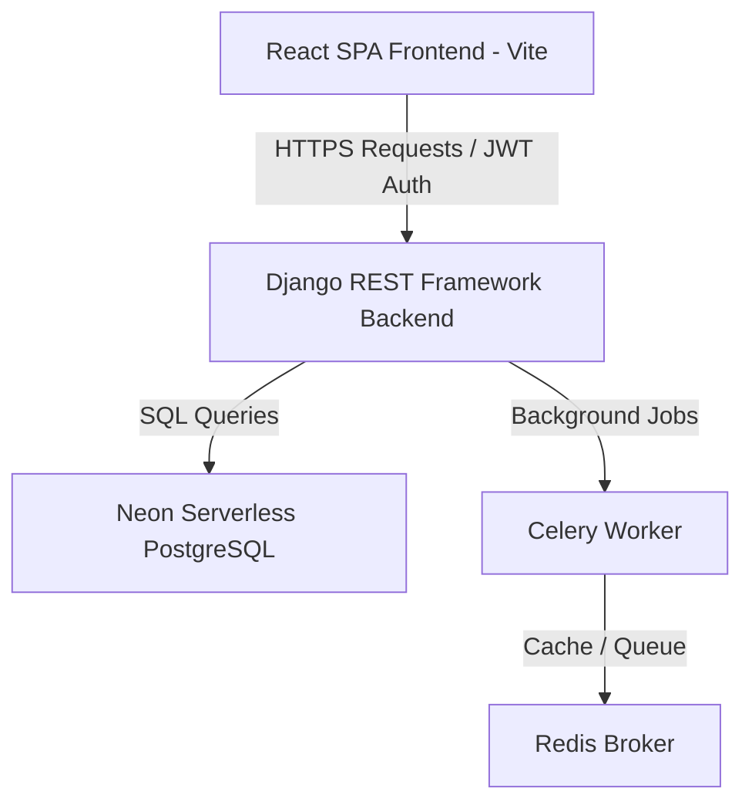

# Interview Project Guide: Attendix Workforce OS

This document serves as your complete guide to explaining the **Attendix Workforce OS** project during an interview. It highlights the architecture, tech stack, and key custom features we built and refactored together.

---

## 1. Project Overview & Architecture
**Attendix Workforce OS** is a SaaS-ready, multi-tenant Workforce Management and HRMS (Human Resource Management System) platform. It allows businesses (companies) to manage branches/firms, departments, designations, real-time GPS-validated attendance, employee leaves, and automated monthly payroll.

### Architectural Layout
The system follows a modern decoupled **Client-Server Architecture**:

---

## 2. Technology Stack & Technical Decisons

| Layer | Technology Used | Why it was chosen |
| :--- | :--- | :--- |
| **Frontend Core** | React (Vite), Redux Toolkit | Fast build times, component reusability, and centralized global state management for auth/user context. |
| **Frontend UI** | Material UI (MUI), Lucide Icons | Material design guidelines, responsive grids, native time/date pickers, and modern glassmorphism styling. |
| **Backend Core** | Django, Python 3.10 | Batteries-included framework, built-in ORM with robust transactions, and clean Model-View-Template separation. |
| **API Framework** | Django REST Framework (DRF) | Serializers handle schema validation automatically, built-in RBAC (Role-Based Access Control) permissions, and ViewSets keep code DRY. |
| **Authentication** | SimpleJWT (JSON Web Tokens) | Stateless authentication containing user metadata (role, company ID, branch name) directly inside custom claims. |
| **Database** | Neon serverless PostgreSQL | Highly scalable relational database, fully ACID compliant, handles foreign key relations for tenants, leaves, and payroll records. |
| **Static Assets** | WhiteNoise | Compresses and serves static bundles directly from the Django backend in production, eliminating the need for complex Nginx/S3 configs for demo tiers. |

---

## 3. Key Custom Features & Code Deep-Dives

Here are the specific complex features we implemented that show advanced coding and architectural skills:

### A. Dynamic Shift Configs (Predefined & Custom)
* **Problem**: Initially, shift times were restricted to database presets. Employers wanted the ability to enter custom times (e.g. 9:00 AM to 11:00 PM) for individual employees.
* **Our Solution**: 
  * Instead of database migrations altering the schema, we added `shift_start_time` and `shift_end_time` strings to the profile serializer.
  * In the serializer's `create`/`update` methods, the backend parses these strings and performs a `get_or_create` lookup on the `Shift` model. If a matching shift doesn't exist, it dynamically creates one named `"Custom Shift (Start - End)"` under that tenant company.
  * **Result**: Schema remains intact, but admins get full flexibility in the UI to type any shift hours they want.

### B. Two-Step Disbursal & Revert Flow for Advances
* **Problem**: Advance salary requests need control. They must be approved first, then marked as disbursed (paid) when the money is actually transferred. Users must also be able to "undo" or revert approved/rejected records back to pending in case of corrections.
* **Our Solution**:
  * Added a `DISBURSED` state to the `AdvanceSalary` status choices.
  * Exposed custom views actions `/disburse/` and `/mark-pending/`.
  * Implemented an auto-revert flow for both leaves and advances. If an admin marks an item as rejected or approved in error, a **"Revert"** button resets its state to `PENDING`, enabling re-evaluation.

### C. Auto-Rejection Hook (15% Base Salary Rule)
* **Problem**: Employers wanted to prevent employees from requesting advances exceeding 15% of their base salary. If requested, it should auto-reject without human intervention.
* **Our Solution**:
  * Added a hook inside the ViewSet `perform_create` method.
  * Before saving, the backend fetches the employee's base salary from their profile, calculates the 15% limit, and compares it with the requested amount. If exceeded, it automatically sets the status to `REJECTED` and saves.

### D. Multi-Step Payroll Recalculation & Mid-Month Deductions
* **Problem**: If an employee receives a mid-month advance (which is marked as `DISBURSED`), how do we calculate their final monthly payslip? What if they recalculate a payslip?
* **Our Solution**:
  * Added `already_paid` and `bonus` columns to the `Payroll` model.
  * On payslip generation, the engine searches for all `DISBURSED` advances for that month. It sums them up, writes the total to `already_paid`, and subtracts them:
    $$\text{Net Salary} = \max(0.0, \text{Base Salary} + \text{Overtime Pay} + \text{Bonus} - \text{PF Deductions} - \text{Already Paid})$$
  * If a payslip is recalculated, it retains past disbursed amounts, resets the state to `DRAFT`, and updates the calculation.
  * Added a **"Remove Bonus"** action endpoint `/remove-bonus/` to clear any bonus inputs and recalculate net salary instantly with one click.

### E. Attendance Safeguard (Missing Checkout Rule)
* **Problem**: If an employee has clocked in but forgotten to clock out on any day of the month, their payroll shouldn't blindly pay them for a full day.
* **Our Solution**:
  * During monthly payroll loops, the engine checks if an attendance record has `check_in_time` set but `check_out_time` is null.
  * If true, that day is excluded from worked days and instead incremented as `absent_days += 1.0`. The employee is only paid for fully completed shifts.

---

## 4. Production Deployment & SPA Routing
* **Backend**: Deployed to Render. Added `dj-database-url` and environment variables to switch database engines seamlessly from local SQLite to production serverless PostgreSQL.
* **Frontend**: Deployed as a static site.
* **SPA Routing Issue**: 
  * *Interviewer Question*: *"Why does reloading the page at `/attendance` on a static site return a 404, and how did you solve it?"*
  * *Answer*: SPAs handle routing in the browser. When you refresh `/attendance`, the hosting server thinks it's a folder on the disk. To solve this, we configured a **Rewrite Rule** on Render (`/*` ➔ `/index.html`), forwarding all routing requests to React Router. We also added this rewrite config directly to [render.yaml](file:///Users/luckyrajput/.gemini/antigravity-ide/scratch/pulseix-workforce-os/render.yaml) for automated blueprint deployments.
